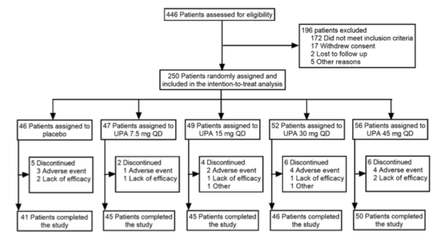
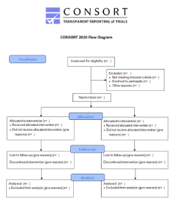
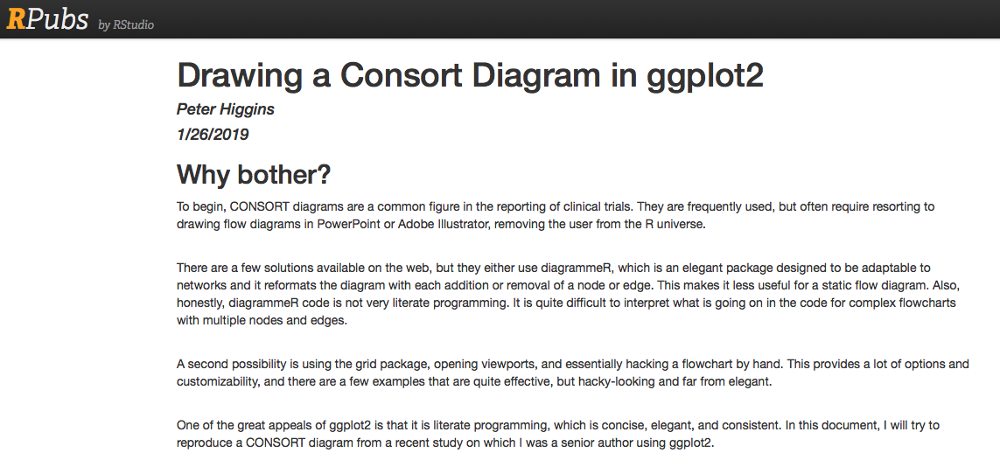
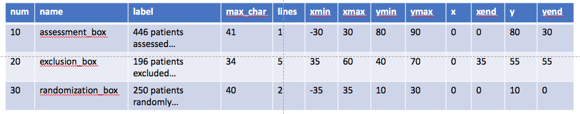
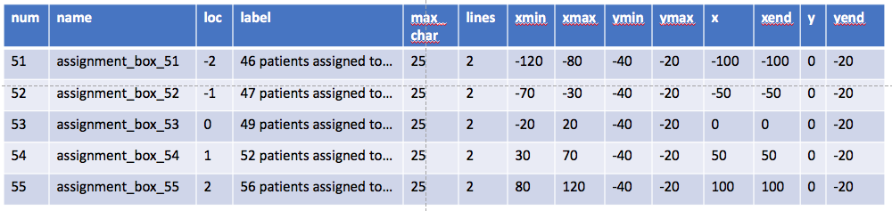
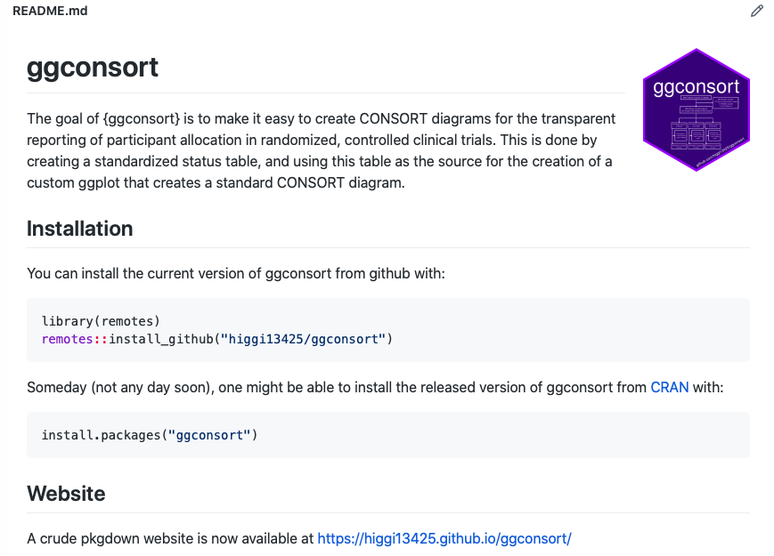

```{r setup, include=FALSE}
options(htmltools.dir.version = FALSE)
library(xaringan)
library(xaringanthemer)
library(tidyverse)
source('create_status_tables.R')
```

```{r xaringan-themer, include=FALSE, warning=FALSE}
library(xaringanthemer)
style_duo_accent(
  primary_color = "#292077" ,
  secondary_color = "#8c54fc",
  inverse_header_color = "#FFFFFF"
)
```

class: header_background

# What Are CONSORT diagrams?

### To promote transparency

In clinical trials, a CONSORT diagram shows the flow of participants from screening to analysis, while identifying and providing reasons for dropout or exclusion of participants at each step along the way.


---

class: header_background

# CONSORT diagrams

### Endorsed by most medical journals
.pull-left[
CONSORT = Consolidated Standards of Reporting Trials, developed by the CONSORT group, <http://www.consort-statement.org>, which started in 1993 to improve the quality of reporting of clinical trials.
]
.pull-right[

]
---

class: header_background

# An Artisanal Product

- CONSORT diagrams are now commonly used to report RCTs,<br>
  but the template provided does not provide: 
  + An underlying data structure, or 
  + Best practices for building a diagram. 
- The CONSORT diagram has become an artisanal product
  + Usually built by counting categories and 
  + Copy/pasting results into templates. 
- This leads to frequent errors in which the participant numbers don't add up. 
- Most CONSORT diagrams are built from templates in 
  + MS Word
  + Powerpoint, or 
  + Adobe Illustrator.
- Note: there is a way to do this in SAS, with PROC SGPLOT
https://www.sas.com/content/dam/SAS/support/en/sas-global-forum-proceedings/2019/3149-2019.pdf
---

class: header_background, center

# {ggconsort} as an Idea


```{r, echo=FALSE, out.width="100%"}

```
- https://rpubs.com/phiggins/461686
---


class: header_background

# Limitations

- This is still being done by hand, not reproducible

- I would like to make this programmatic


---


class: header_background

# {ggconsort} Goal: One Function

## draw_consort(status_table)

- any # of arms from 2 to 8 (or more)

- can control text wrap with `\n` or str_wrap(25)

- fits boxes to height, width of text

- creates lines and arrows to box center edges

- sets standard vertical and horizontal spacing between boxes, lines

- creates plot area sufficient to contain diagram

- then draws the diagram

---
class: header_background

# What is the Underlying Data Structure?

---
class: header_background

# Two Parts to CONSORT - N = 1 and N = n_arms


---

class: header_background

# Naming and labeling components

---

class: header_background
# Data Model: the Status Table
- One row per candidate participant, with their status at each step of the study

- Includes both: 
  + randomized participants, and
  + candidate participants excluded (aka screen failures)
  
- (optional) column - studyid
- column `randomized` -             Yes or NA
- column `exc_reason` -             Text or NA
- column `arm` -                    Text per Arm or NA
- column `recieved_int` -           Yes or NA
- column `dnr_int_reason` -         Text or NA
- column `completed` -              Yes or NA
- column `discontinued_reason` -    Text or NA
- column `analyzed` -               Yes or NA
- column `not_an_reason` -          Text or NA

---

class: header_background

# Example Data - status_tables
- I built examples from actual clinical trials, numbered by # of arms

  + status2 -  (Indomethacin vs Placebo)
  + status3 -  (Aza vs IFX vs Aza/IFX combo)
  + status4 -  (Placebo vs 5,10,15 mg tofacitinib)
  + status5 - (Placebo vs 4 doses of upadacitinib)
  + status8 -  (8 interventions to increase uptake of flu vaccine)
---


class: header_background
# Glimpse of a Status Table
```{r, echo=FALSE}
glimpse(status2)
```

---

class: header_background
# Conceptual Model for Drawing CONSORT

- Build a top_tbl


- Then ggplot
```{r, eval=FALSE, echo=TRUE}
ggplot(top_tbl) +
  geom_rect(aes(xmin = xmin, xmax=xmax, ymin=ymin, ymax=ymax)) +
  geom_text(aes(x=xcenter, y = ycenter, label= label)) +
  geom_segment(aes(x=x, xend=xend, y=y, yend=yend))
```

---

class: header_background
# Conceptual Model

- Build a bottom_n_tbl 
- Shown here are just the assignment rows


- Then ggplot
```{r, eval=FALSE, echo=TRUE}
ggplot(bottom_n_tbl) +
  geom_rect(aes(xmin = xmin, xmax=xmax, ymin=ymin, ymax=ymax)) +
  geom_text(aes(x=xcenter, y = ycenter, label= label)) +
  geom_segment(aes(x=x, xend=xend, y=y, yend=yend))
```

---


class: header_background
# Helper Functions in Place

- count_arms, list_arms

- for individual labels: filter and count #, glue to text for each box 

- for complex labels: count exclusions, build mini-table, add total row, move to top line, collapse to text string with newlines
  + Does not handle zeroes well (no discontinuations)

- build top_tbl

- (_in progress_) build bottom_n_tbl

---

class: header_background
# Problems

- I don't know enough about ggplot internals
  + Hard to consistently convert char_width to x values on ggplot
  + Hard to consistently convert lines to y values on ggplot
  + Adding more rows of boxes = self-adjusting ggplot size shrinks previous boxes - labels no longer fit
- Would this be easier with the {ggtext} package?
  + but lacks return values for box location
- Actually building a whole package with tests, roxygen documentation, pkgdown website
  + This is way beyond what I have ever done
  + There is no way I could maintain a package alone.

- Help needed

---

class: header_background
# Aspiration: Package / Repository
.center[
https://github.com/higgi13425/ggconsort
]

```{r, echo=FALSE, out.width="80%", fig.align='center'}

```
---
class: header_background
# The Aspirational Hex Sticker

```{r, echo=FALSE, out.width="53%", fig.cap="Because if you have a cool hex sticker you are committed", fig.align='center'}

```


---
class: header_background
# Help (Collaborators) Needed!
- This is just a proof of concept, **not** a proper package.
### Aspirational Goals
- Tests, especially on status_table input
  + e.g. Actual software dev by people who know what they are doing
- Can this work across Graphics Devices (not just MacOS/RStudio)?
- Helper functions to take standard data formats and make a status_table from:
  + SDTM data format?
  + ADaM data format?
- Ability to work with data in the wild (1/0, "No"/Yes", "Completed")
  + Not just carefully curated data
- Useful vignettes
- A proper package (roxygen2) and a useful {pkgdown} site
- More options, customization - currently like the original Model T.
  + You can have any font or spacing that you want, as long as it is the default.

---
class: inverse, center, middle

# Thanks for your Help!


